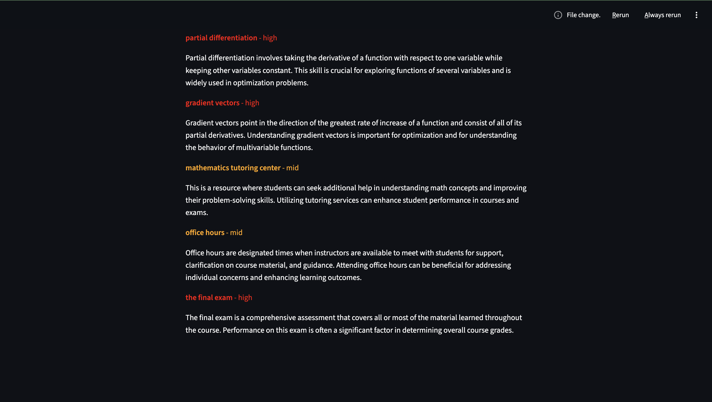

# Lecture Gap Finder

Detects what a professor skipped or underemphasized compared to the course syllabus.
Upload a syllabus PDF and a lecture transcript — get back a prioritized list of topics to study.

## Setup

```bash
# 1. Clone and enter the project
git clone https://github.com/Arjun-P01/Lecture-Gap-Finder
cd lecture-gap-finder

# 2. Create a virtual environment
python -m venv venv
source venv/bin/activate        # Windows: venv\Scripts\activate

# 3. Install dependencies
pip install -r requirements.txt

# 4. Download the spaCy English model
python -m spacy download en_core_web_sm

# 5. Add your OpenAI API key
cp .env.example .env
# Then edit .env and paste your key

# 6. Test Day 1 parsers
python parsers.py path/to/syllabus.pdf path/to/transcript.txt
```

## Run the app (Day 4+)

```bash
streamlit run shell.py
```

## Project structure

```
lecture_gap_finder/
├── parsers.py        # PDF + transcript parsing
├── nlp_core.py         # NLP topic extraction + gap analysis
├── gpt_analysis.py    # GPT-powered summaries + scoring
├── shell.py            # Streamlit frontend
├── requirements.txt
├── .env.example
└── .gitignore
```

## Where to find test data

- **Syllabi**: [MIT OpenCourseWare](https://ocw.mit.edu) — every course has a free PDF syllabus
- **Transcripts**: Open a YouTube lecture → `...` menu → Open transcript → copy/paste to .txt

## Tech stack

- `PyMuPDF` — PDF text extraction
- `spaCy` — NLP topic extraction
- `OpenAI GPT-4o-mini` — gap explanations + study priority scoring
- `Streamlit` — web UI

## Screenshot


## Limitations
1. When topics change the cache doesn't automatically update
2. GPT response takes 20-30 seconds which may cause users to leave
3. Topic extraction can pick up topics that aren't of interest
4. Scanned PDFs won't work
5. Meaningful results are only displayed when syllabus and transcript are from the same course